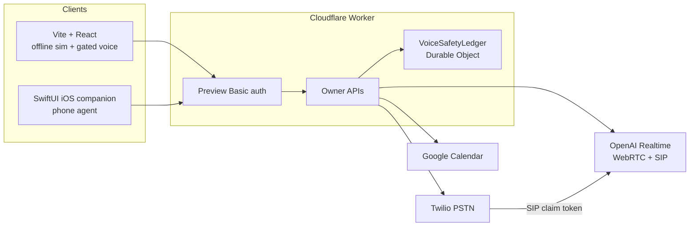

# Slim Sales Agent

Flowstate's owner-operated sales and phone assistant. It helps an operator run
warm, consented discovery conversations and place disclosed AI telephone calls
on the operator's behalf. Bundle id: `ai.flowstateinc.slimsalesagent`.

## What it does

The browser app is a command center for an openly disclosed AI discovery
salesperson. Offline, it simulates a full discovery call against a synthetic
prospect, grades ten behavioral scenarios, and shows live qualification and
safety state. Online, after explicit owner action and configured secrets, it
can start a gated OpenAI Realtime voice session.

A Cloudflare Worker serves the production assets and authenticated owner APIs.
The same Worker owns the phone path: Twilio for the carrier leg, OpenAI
Realtime SIP for the spoken conversation, and optional Google Calendar access
for availability and confirmed scheduling. An iOS companion (`ios/`) is the
phone-agent surface: saved people, attested new numbers, recents, and
emergency stop.

This is not a cold-outbound dialer. Calls are owner-initiated to a saved person
or an attested North American number.

## Business problem

Service-business owners take messy, high-context calls and then lose the
thread: competing ideas, undefined scope, and no written next step. They also
need a bounded way to let an AI secretary handle routine telephone requests
without impersonating a human, leaking credentials, or placing unattended
sales calls.

Slim Sales Agent keeps discovery disciplined (one question at a time, launch
vs later, no invented price or professional advice) and keeps the phone
assistant on a short leash (disclosure, objective, spend and concurrency
leases, do-not-call).

## Demo

No API keys are required for the offline path.

```bash
npm ci
npm test
npm run dev
```

Open `http://127.0.0.1:4173/`. Use the simulation UI: transcript, doctrine,
evaluations, and verification. Paid browser voice and live telephone calls do
**not** run in this mode.

Live phone, live Realtime voice, and Google Calendar need Worker secrets.
Those values live in gitignored `.dev.vars` / `.env.local` and in Wrangler
secrets. This repository does not include them. `wrangler` may print
`Missing required secrets: OPENAI_API_KEY, ...` during tests; that warning is
expected and harmless.

## Architecture



## How it works

1. **Offline sim.** The browser holds a synthetic discovery call in local
   state. Graders in `src/evals/cortez.ts` score ten scenarios. No network
   call is required.
2. **Gated browser voice.** After safety JSON, spend-cap confirmation, and an
   explicit click, the Worker mints a short-lived Realtime client secret. The
   browser never holds the standard API key.
3. **Phone.** The owner picks a saved contact or attests a new `+1` number,
   writes a call objective, and confirms. The Worker reserves a safety lease,
   Twilio dials, OpenAI answers SIP with a one-time claim token, and the
   assistant discloses that it is AI and that the call is not recorded.
4. **Calendar.** If Google OAuth is connected, the assistant can read
   availability. It creates or updates events only when the objective asks
   for scheduling and the caller confirms the details.
5. **Safety.** Durable Object leases cap concurrent sessions, daily/lifetime
   counts, and reserved spend. Browser `POST /api/realtime/release` cannot
   release a phone lease. Ambiguous Twilio creates stay counted until
   terminal reconciliation.

## Implemented vs planned

**Implemented**

- Offline discovery simulation and the ten-scenario eval harness
- Command-center verification (qualification, doctrine, safety labels)
- Gated OpenAI Realtime browser voice
- Owner phone pilot: saved people, attested new North American numbers, DNC,
  recents, hang-up
- Google Calendar OAuth (read; confirmed writes when the objective allows)
- iOS companion for the phone agent
- Preview HTTP Basic auth and runtime safety config

**Not implemented / not claimed**

- Call transcripts (Phase 2 design exists; Phase 1 is non-transcript)
- Measured latency samples sufficient to claim R-018
- CRM writes, Apollo mutations, pricing, proposals
- IVR / keypad menus, structured appointment results in the app
- Emergency calls, purchases, cold outbound
- Production deploy (explicit owner approval)

## Tech actually used

- TypeScript, Vite, React 19
- Cloudflare Workers, Durable Objects, Wrangler
- OpenAI Realtime (`gpt-realtime-2.1` in `src/lib/realtime-config.ts`)
- Twilio Voice
- Google Calendar API
- SwiftUI (iOS 17+), bundle `ai.flowstateinc.slimsalesagent`
- Vitest

## Synthetic demo

The offline fixture is a made-up prospect, **Alex Rivera** at Riverside Youth
Sports, referred by **Jordan Lee**. It is not a live client. The eval harness
still lives in `src/evals/cortez.ts` / `createCortezFixtureState()` so existing
tests keep their names; only the persona copy is generic.

The default saved phone contact is labeled **Primary** and is seeded from
`TWILIO_VERIFIED_NUMBER` when the owner list is empty. Tests use a fictional
`+15555550100` number, not a real destination.

## Setup

1. Node.js 22 or newer.
2. `npm ci`
3. Offline: `npm run dev` (port `4173`).
4. Quality: `npm run lint`, `npm run typecheck`, `npm test`, `npm run build`,
   `npm run format:check`.
5. Worker (after `npm run build`): `npm run worker:dev`. Preview username is
   `operator`; password is `PREVIEW_PASSWORD`.
6. iOS: open `ios/SlimSalesAgent.xcodeproj` on macOS. `WorkerBaseURL` in
   `ios/Configuration/Info.plist` is a placeholder
   (`https://sales-agent.example.workers.dev`); point it at your Worker host.

Required Worker secret **names** (values never belong in git):

- `OPENAI_API_KEY`
- `OPENAI_PROJECT_ID`
- `OPENAI_WEBHOOK_SECRET`
- `PREVIEW_PASSWORD`
- `TWILIO_ACCOUNT_SID`
- `TWILIO_API_KEY_SID`
- `TWILIO_API_KEY_SECRET`
- `TWILIO_FROM_NUMBER`
- `TWILIO_VERIFIED_NUMBER`

Optional Worker vars for Calendar: `GOOGLE_CALENDAR_CLIENT_ID`,
`GOOGLE_CALENDAR_CLIENT_SECRET`, and `GOOGLE_CALENDAR_LOGIN_HINT` (omit the
hint unless you want Google to preselect an account). Register this redirect
URI on the OAuth client, substituting your real host:

```text
https://<your-worker-host>/api/google/oauth/callback
```

Do not deploy, place a real call, or rename env vars without owner approval.

## Business impact

Operators get a repeatable discovery motion they can demo without credentials,
plus a production-shaped phone secretary that already has disclosure, spend
caps, and destination policy. The gap between demo and live is configuration,
not a second product: turn on secrets locally when you want Realtime voice or
Twilio; leave them unset for `npm test` and the sim UI.
